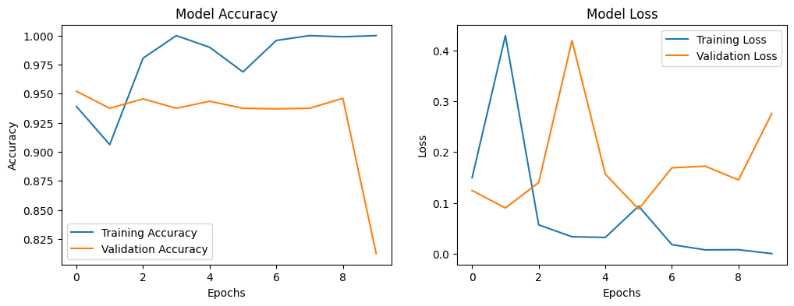

# Fire Detection Using Transfer Learning

This project implements a fire detection system using transfer learning with the MobileNetV2 model and TensorFlow/Keras. It leverages a dataset from Kaggle, containing images classified as either "Fire" or "Non-Fire." The model is designed to effectively identify fire in real-time using CCTV footage or similar image sources.

## Table of Contents

- [Installation](#installation)
- [Dataset](#dataset)
- [Project Structure](#project-structure)
- [Usage](#usage)
- [Model Training](#model-training)
- [Results](#results)
- [License](#license)

## Installation

To set up the project, follow these steps:

1. **Clone the Repository**
   ```bash
   git clone https://github.com/AdityaSingh095/CCTV_fire_detection.git
   cd CCTV_fire_detection
   ```

2. **Set Up a Virtual Environment (Optional but recommended)**
   ```bash
   python -m venv venv
   source venv/bin/activate  # On Windows use `venv\Scripts\activate`
   ```

3. **Install Required Packages**
   Make sure you have Python installed, and then run:
   ```bash
   pip install -r requirements.txt
   ```

## Dataset

This project uses a dataset sourced from Kaggle. The dataset is organized into three directories:

- `Train` - Contains images labeled as `Fire` and `Non-Fire` for training the model.
- `Validation` - Contains images for validating the model performance.
- `Test` - Contains images for testing the model.

### Dataset Structure

```
dataset/
    ├── Train/
    │   ├── Fire/
    │   └── Non-Fire/
    ├── Validation/
    │   ├── Fire/
    │   └── Non-Fire/
    └── Test/
        ├── Fire/
        └── Non-Fire/
```


### Training Parameters

- **Batch Size**: 32
- **Epochs**: Adjust as necessary; starting with 10 is recommended for initial testing.

## Results

After training, you can visualize the model's performance metrics, including accuracy and loss, using Matplotlib. Evaluate the model on the test dataset to see its effectiveness in detecting fire.
 

